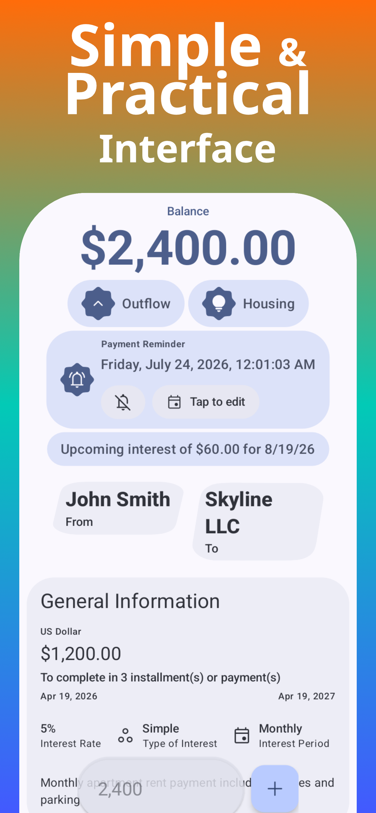
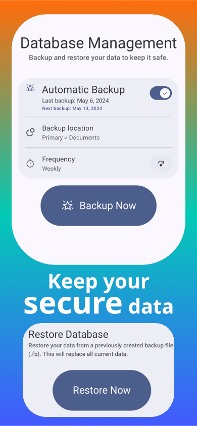
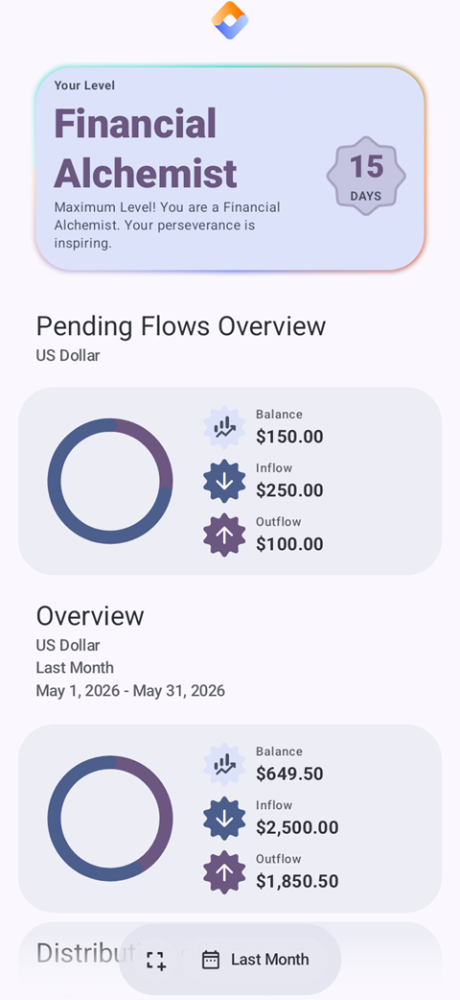
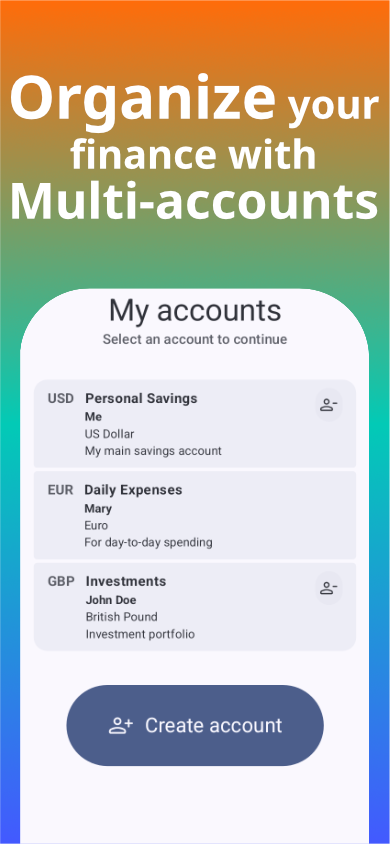
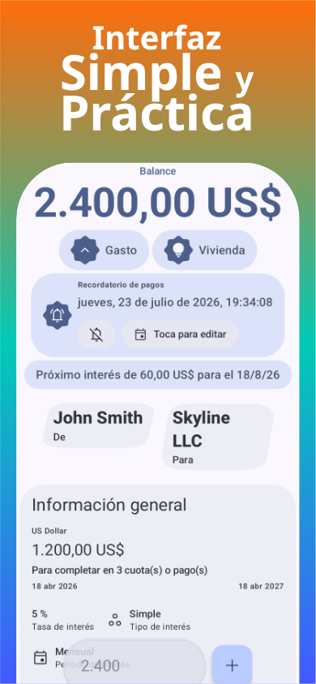
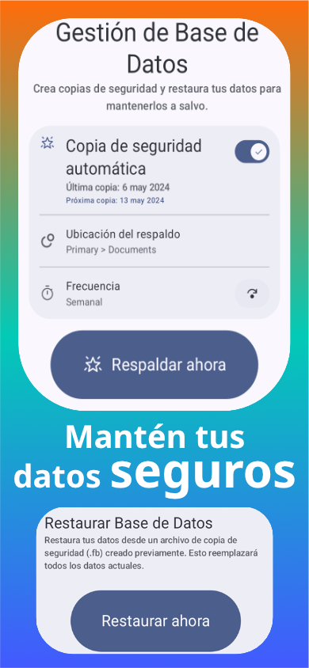
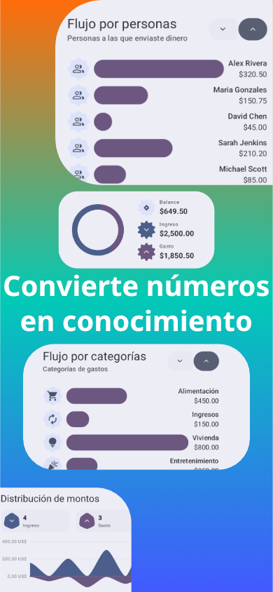

  

<h1 align="center">Flow Balance</h1>

## 🌐 Available Languages / Idiomas Disponibles

* [🇺🇸 English Version](#-english) — **Your Finance Manager, Simple and Private**
* [🇪🇸 Versión en Español](#-español) — **Tu Gestor de Finanzas, Simple y Privado**

---

## 🇺🇸 English

Organize your income and expenses, recording every movement with a focus on simplicity and your privacy.
Flow Balance is the modern solution for managing your personal finances. Designed to be efficient, clear, and organized, it allows you to take complete control based on three pillars: **Offline Priority**, **Modern Interface**, and a strict **Commitment to Privacy**.

### ✨ Key Features

> ⚠ **Warning:** The app does not display currency conversion rates and does not perform currency exchanges. All records remain in the currency you choose.

 

| 1 | 2 | 3 | 4 |
| --- | --- | --- | --- |
|  |  |  |  |

---

### ⬇️ Download and Setup (Sideload)

Flow Balance is downloaded directly from its official source on GitHub (**Sideloading**). To avoid security risks, always download only from the official `zmr-software` link.

#### 1. Choose the Right Version for Your Phone
* **arm64-v8a (Recommended):** For modern smartphones. Faster and more efficient.
* **universal:** Works on any phone, though the file size is a bit larger.

#### 2. Installation Steps
1. **Visit the Official Site:** Go to the [GitHub Releases](https://github.com/zmr-software/FlowBalance/releases) page.
2. **Download the File:** Tap the appropriate `.apk` file to start downloading.
3. **Authorize Installation:** If Android prompts a security warning, tap **Settings** and toggle **"Allow from this source"**.
4. **Install:** Go back, tap **Install**, and open the app.

---

### ⚙️ Technologies Used
* **Kotlin** & **Jetpack Compose** (Modern & High-performance UI)
* **Room** (Local and fully offline data persistence)
* **Cryptography** (Ensures the protection and security of sensitive data)

---

### 🔒 License
Private License software. All rights reserved. Distribution, modification, or usage is strictly restricted.

---

### 📬 Contact
**ZMR / Flow Balance** - Help us improve by reporting bugs!
* **Email:** helpZMR+flowbalance@proton.me
* *Please include: App Version, OS Version, and steps to reproduce the error.*

---

## 🇪🇸 Español

Organiza tus ingresos y egresos, registra cada movimiento con un enfoque en la simplicidad y tu privacidad.
Flow Balance es la solución moderna para la gestión de tus finanzas personales. Diseñada para ser eficiente, clara y organizada, te permite tomar el control total bajo tres pilares: **Prioridad Offline**, **Interfaz Moderna** y un firme **Compromiso con la Privacidad**.

### ✨ Características Principales

> ⚠ **Advertencia:** La aplicación no muestra tasas de conversión de divisas ni realiza cambios de moneda. Todos los registros permanecen en la moneda que elijas.

 

| 1 | 2 | 3 | 4 |
| --- | --- | --- | --- |
|  |  |  |  |

---

### ⬇️ Descarga y Uso (Distribución Sideload)

Flow Balance se descarga directamente desde su fuente oficial en GitHub mediante **Sideloading** (instalación externa). Descárgala únicamente desde el enlace oficial de `zmr-software` para evitar riesgos de seguridad.

#### 1. Elige la versión correcta para tu móvil
* **arm64-v8a (Recomendado):** Para móviles modernos. Es más rápida y eficiente.
* **universal:** Funciona en cualquier teléfono, aunque el archivo suele ser un poco más pesado.

#### 2. Pasos para la instalación
1. **Entra a la web oficial:** Ve a la pestaña de [Lanzamientos en GitHub](https://github.com/zmr-software/FlowBalance/releases).
2. **Descarga el archivo:** Pulsa sobre el archivo `.apk` correspondiente para iniciar la descarga.
3. **Autoriza la instalación:** Si Android muestra un aviso de seguridad, haz clic en **Ajustes** y activa la casilla **"Permitir desde esta fuente"**.
4. **Instala y disfruta:** Regresa atrás, selecciona **Instalar** y abre la app.

---

### ⚙️ Tecnologías Utilizadas
* **Kotlin** y **Jetpack Compose** (UI moderna y de alto rendimiento)
* **Room** (Persistencia de datos local y 100% offline)
* **Criptografía** (Garantiza la protección y seguridad de tus datos sensibles)

---

### 🔒 Licencia
Software de Licencia Privada. Todos los derechos reservados. La distribución, modificación o uso están estrictamente restringidos.

---

### 📬 Contacto
**ZMR / Flow Balance** - ¡Tu feedback es crucial!
* **Correo:** helpZMR+flowbalance@proton.me
* *Por favor incluye: Versión de la App, Versión del Sistema Operativo y los pasos para reproducir el fallo.*

